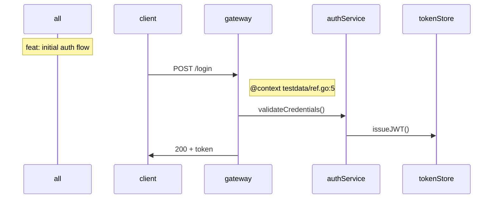

## Flow: UserAuth (v1.0.0)

```mermaid
sequenceDiagram
    Note over all: feat: initial auth flow
    client->>gateway: POST /login
    Note right of gateway: @context testdata/ref.go:5
    gateway->>authService: validateCredentials()
    authService->>tokenStore: issueJWT()
    gateway->>client: 200 + token
```
